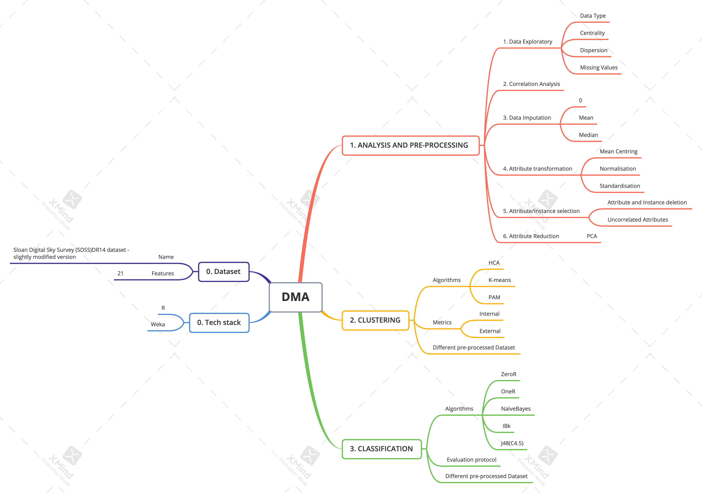

# Data Modelling Analysis
Data Modelling and Analysis on a modified version of the Sloan Digital Sky Survey (SDSS)DR14 dataset.  
* Data Analysis and Pre-processing
* Data Mining
* Clustering and Classification

## Prerequisites

- Packages:  
  * dplyr
  * ggplot2
  * ggplot2
  * gridExtra
  * knitr
  * cluster.datasets
  * cluster
  * e1071
  * fpc
  * xlsx

## Built With

* [R](https://www.r-project.org/) - Programming language
* [Weka](https://waikato.github.io/weka-wiki/) - Machine Learning Software

## Files
### code
- modelling_analysis.Rmd :  R Markdown for Data Modelling Analysis.
- cw_data.csv :  A modified version of the Sloan Digital Sky Survey (SDSS)DR14 [dataset](https://www.sdss.org/dr14/).
- Feedback_Coursework.pdf :  Project requirement and general feedback.
- report.pdf :  Final report.
- structure.png :  Structure of the project.

## Structure

## License

This project is licensed under the MIT License - see the [LICENSE](LICENSE) file for details.  
If you want to cooperate or use this project, please contact the author: wangchi.work@gmail.com
